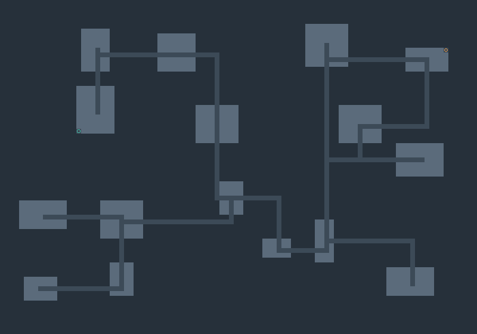
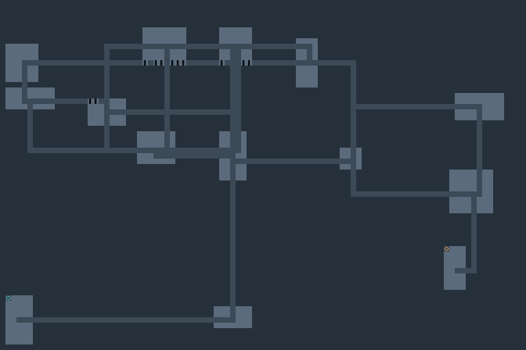

# Delvegen

> **built with ox alpha**
>
> most of this was written in august 2026 during the free preview window of
> [ox alpha](https://openrouter.ai/stealth/ox-alpha), an anonymous stealth model
> that turned up on openrouter for about a week. i set the direction and reviewed
> what came back. the tests are real and they pass — clone it and run them.

A procedural dungeon generator that shows its work: five genuinely different generation
algorithms, seeded determinism you can verify, frame-by-frame step-through visualization,
and metrics for comparing what each technique actually produces. Built for game developers
who need levels and want to understand how procedural generation works under the hood.




## Install

Requires Node.js 18+.

```sh
git clone https://github.com/TheFadGhost/delvegen.git
cd delvegen
npm install
npm run build
```

## Run

Web UI (pan with drag, zoom with wheel):

```sh
npm run dev          # http://localhost:8123
```

CLI:

```sh
node dist/src/cli/main.js generate --algorithm bsp --seed alpha --width 100 --height 70 --format ascii
node dist/src/cli/main.js generate --algorithm cellular --seed cave1 --format png --out cave.png --stats
node dist/src/cli/main.js batch --algorithm rooms-mst --seeds 50 --out stats.json
node dist/src/cli/main.js algorithms
```

Library (headless):

```js
import { bootstrapDelvegen, generateDungeon, computeMetrics } from "delvegen";

bootstrapDelvegen(); // once
const dungeon = generateDungeon({
  algorithm: "rooms-mst",
  seed: "alpha",
  width: 90,
  height: 60,
  params: { roomCount: 14 },
  post: { repair: true, prune: true, doors: { doorChance: 80 }, thin: true },
});
const metrics = computeMetrics(dungeon);
```

The same seed and parameters always produce byte-identical output on every platform; the
test suite freezes golden hashes to enforce it (`tests/golden.json`, regenerated only via
`npm run golden:update -- --reason "..."` with the reason logged).

## Algorithms

| id | Name | Technique | What it produces |
|---|---|---|---|
| `bsp` | Binary Space Partitioning | Recursively splits the map into rectangles, places one room per leaf, then connects sibling subtrees with L-corridors down the tree. | Regular room-and-corridor layouts; corridor structure mirrors the partition tree, so it stays tree-shaped unless loops are added elsewhere. |
| `cellular` | Cellular Caves | Random wall/floor noise smoothed by repeated birth/survival majority rules over 8-neighbourhoods. | Organic blob-like caverns with natural chokepoints; no rectangular rooms at all. |
| `rooms-mst` | Rooms + MST | Rejection-places non-overlapping rooms, links them with a minimum spanning tree of L-corridors, then adds a tunable share of extra loop edges. | Classic roguelike floor plans; `loopEdgePct` controls how many shortcuts exist beyond the pure tree. |
| `drunkard` | Drunkard's Walk | Random walkers carve tunnel from the centre outward until a coverage target is hit; straightness bias trades knots for winding passages. | Wholly-corridor caves, no rooms; the most organic silhouettes of the five. |
| `wang` | Template Stitching | The map divides into 16x16 cells; an edge lottery opens passages between neighbours, union-find repair guarantees one component, then each cell is stamped from a hand-drawn template pack keyed by its 4-edge signature. | Modular chamber complexes with consistent doorways, pillars and alcoves; structure comes from the template art, not from carving. |

Every algorithm terminates by construction or via hard step caps; every result is verified
by flood fill before it is returned (see Connectivity below).

### Parameters

Defaults are shown; ranges in brackets. All are also visible live in the UI panel.

**bsp**: `minLeafSize` [8..40] def 16 - smallest leaf dimension; `roomPadding` [0..4] def 1 -
room inset inside leaf; `corridorWidth` [1..3] def 1; `maxDepth` [2..10] def 6 - split budget;
`roomMinSize` [3..10] def 4; `roomMaxSize` [4..20] def 10.

**cellular**: `initialWallPct` [30..70] def 45; `smoothingPasses` [1..8] def 5;
`birthLimit` [0..8] def 5 - open tile becomes wall at this wall-neighbour count;
`survivalLimit` [0..8] def 4 - wall tile survives above this count; `keepLargestOnly` def true -
seal pockets other than the largest cavern.

**rooms-mst**: `roomCount` [0..60] def 12; `roomMinSize` [3..10] def 4; `roomMaxSize` [4..24]
def 9; `placementAttempts` [50..2000] def 400; `corridorWidth` [1..3] def 1; `loopEdgePct`
[0..100] def 15 - percentage of non-tree edges added back as loops.

**drunkard**: `floorTargetPct` [5..70] def 38 - percent of map to open;
`straightness` [0..0.95] def 0.35 - probability a walker keeps heading; `walkers` [1..4] def 1;
`borderWall` def true - keep a solid border ring.

**wang**: `tileSize` enum `16`; `openness` [20..90] def 55 - initial share of open interior
edges; `variantMix` enum `varied|corridor|chamber` def varied - template selection bias.

### Post-processing passes

Applied in fixed order after generation. Each is independently toggleable.

| Pass | Effect |
|---|---|
| `repair` | Flood-fill labels regions and carves shortest-pair corridors until one walkable region remains. |
| `prune` | Removes corridor dead ends iteratively (`pruneDepth` sweeps); room floors are never removed. |
| `doors` | Converts corridor-mouth tiles at room boundaries to door tiles with probability `doorChance`. |
| `thin` | Melts fully-enclosed wall specks (size <= `minCluster`) into floor; never touches the border ring. |

Connectivity is guaranteed regardless of pass configuration: if verification fails after your
chosen passes, the pipeline runs repair automatically and verifies again before retrying the
whole attempt.

## Metrics

Computed over the final grid; formulas are pinned by tests against hand-built fixtures.

- **Rooms / Avg room size** - generator-recorded rooms and their mean area.
- **Corridor/room ratio** - corridor+door tiles per room-floor tile.
- **Dead ends** - walkable tiles with exactly one walkable neighbour.
- **Path length** - BFS shortest-path steps between entrance and exit (exit is the farthest
  walkable tile from the entrance, chosen deterministically).
- **Branch factor** - mean walkable-neighbour count across junctions (tiles with >= 3).
- **Open tiles** - percentage of the map that is walkable.

## Visualizer

Pan by dragging, zoom with the wheel (+/- keys). Step mode re-runs generation while recording
frames: scrub the timeline, play at 0.5x/1x/4x, read what each phase does from per-frame
labels. With `prefers-reduced-motion`, playback is disabled and the scrubber is the transport.
Comparison mode runs two independent parameter sets side by side. Export menu produces PNG,
JSON (re-importable), ASCII; configurations share as URLs. Distribution histograms sample
fixed parameters across seeds. A "Verify determinism" button replays the current seed twice
and confirms byte-identical output.

Four themes ship (dark technical default, light, high contrast, stylised Relic). Tile roles
are distinguishable by lightness and shape markers, not hue alone: doors draw a bar across the
passage, dead ends carry a centre dot, entrance is a circle and exit a diamond, unreachable
regions get hatching.

## Architecture

The library core has no DOM dependencies. Everything funnels through one contract:

```ts
interface GeneratorDefinition {
  id: string;
  name: string;
  summary: string;
  technique: string;
  params: ParamSpec[];                  // declarative, drives UI + CLI validation
  validate(width, height, params): void; // actionable ValidationError or nothing
  generate(ctx: GenerationContext): DungeonData;
}
```

`GenerationContext` supplies validated parameters, a deterministic `Rng` (xoshiro128**
seeded through splitmix32/FNV-1a; no `Math.random` anywhere) and an optional frame recorder.
Algorithms must be deterministic given seed+params and must terminate. The pipeline in
`src/core/generate.ts` validates, generates, applies post passes in canonical order, flood-fill
verifies connectivity, retries on a derived RNG stream within a bounded budget, then assigns
entrance/exit via double-BFS farthest-pair. Renderers, exporters, CLI and tests all consume the
same objects; nothing duplicates algorithm logic.

Layout: `src/core` (contracts + pipeline), `src/algorithms`, `src/post`, `src/analysis`
(regions/metrics), `src/export`, `src/cli`, `src/render` + `src/ui` (the only DOM-touching code).

## Development

```sh
npm run build         # tsc -> dist/
npm test              # build + node:test suite (65 tests incl. golden determinism)
npm run dev           # static server for the web UI
node scripts/matrix-check.mjs   # 5 algos x 5 post configs x 4 seeds integration check
```

Performance note, measured with `process.hrtime.bigint()` around 20 sequential
`generateDungeon` calls per algorithm at canonical sizes on the dev machine (Node 24,
Windows): drunkard 0.46 ms (80x50), bsp 0.18 ms (100x70), rooms-mst 0.19 ms (90x60),
cellular 1.21 ms (80x50), wang 0.70 ms (66x66). No performance claims beyond that method
are made.

## License

MIT. See LICENSE.